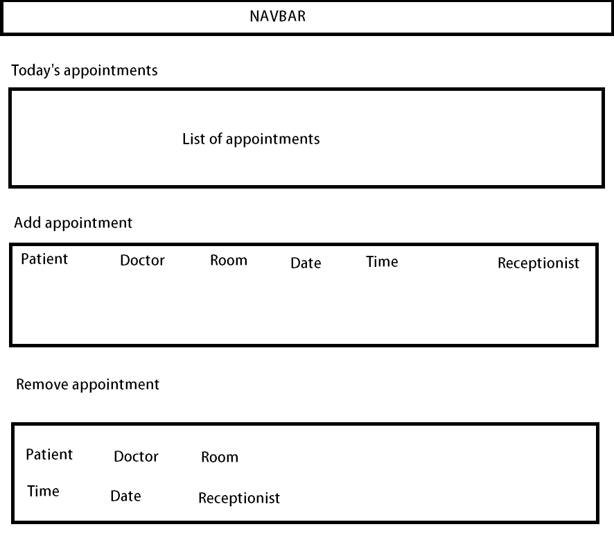
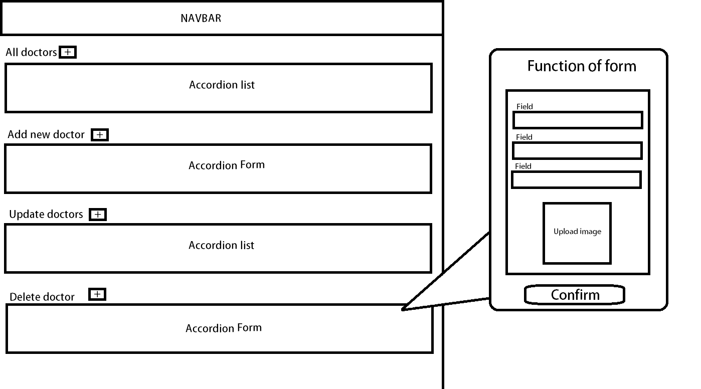
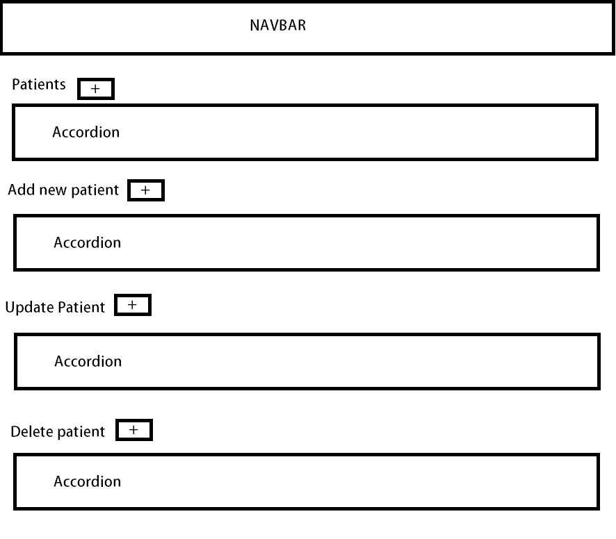
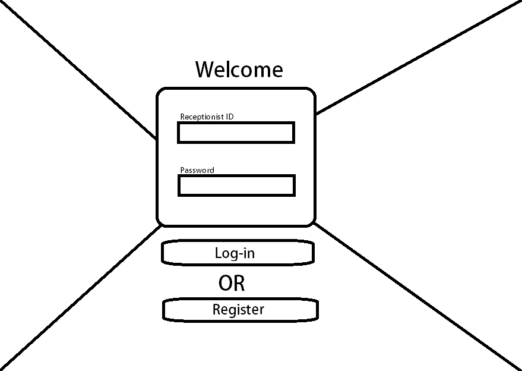
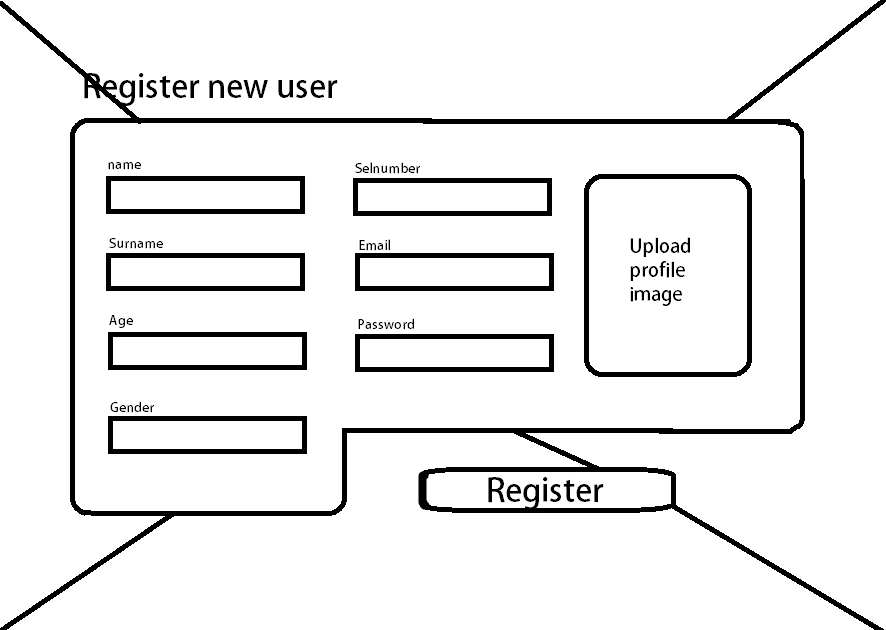

<br />
<h5 align="center" style="padding:0;margin:0;">Glen Dorner</h5>
<h5 align="center" style="padding:0;margin:0;">221358</h5>
<h6 align="center">DV200 | Term 2</h6>
</br>
<p align="center">

  <a href="https://github.com/GlenDorner221358/Medical-Database">
    
  </a>

<h3 align="center">Medical database interface</h3>

  <p align="center">
    This is an interface website that connects to the medical_database DB and allows for the editing and viewing of information in the database.<br>

   <br />
   <br />
   <!-- <a href="https://youtu.be/8iZ_rSmcN0E">View Demo</a> -->

</p>
<!-- TABLE OF CONTENTS -->

## Table of Contents

- [About the Project](#about-the-project)
    - [Project Description](#project-description)
    - [Built With](#built-with)
- [Getting Started](#getting-started)
    - [Prerequisites](#prerequisites)
    - [How to install](#how-to-install)
- [Features and Functionality](#features-and-functionality)
- [Concept Process](#concept-process)
    - [Ideation](#ideation)
    - [Wireframes](#wireframes)
- [Development Process](#development-process)
    - [Implementation Process](#implementation-process)
        - [Highlights](#highlights)
        - [Challenges](#challenges)
    - [Future Implementation](#peer-reviews)
- [Final Outcome](#final-outcome)
    - [Mockups](#mockups)
    - [Video Demonstration](#video-demonstration)
- [Conclusion](#conclusion)

<!--PROJECT DESCRIPTION-->

## About the Project

<!-- header image of project -->

<!-- ![image1][image1] -->

### Project Description

Welcome to my medical database interface. This is not a website so much as it is just a tool to interface with a database. Of course it wont really work if you dont have a database that corresponds to the one used in the development of the project. This interface allows for the editing of database information and viewing of entries as well as user log in system.

### Built With

HTML5
PHP
JS
CSS

<!-- GETTING STARTED -->
<!-- Make sure to add appropriate information about what prerequesite technologies the user would need and also the steps to install your project on their own mashines -->

## Getting Started

These instructions will get you a copy of this project up and "running" on your local machine for testing.

### Prerequisites

You are going to need XAMPP and a code editor on your machine, as well as a database set up as follows:
DB = medical_database
tables:
appointments
doctors
patients
receptionists
Rooms

appointments:
ID
Doctor ID
Patient ID
Room ID
Time
Date
Receptionist ID

doctors:
ID
Name
Surname
Age
Gender
PhoneNumber
Email
Specialisation
Room

patients:
ID
Name
Surname
Age
Gender
PhoneNumber
Email
MedicalAidNumber
PreviousAppointments

receptionists
ID
Name
Surname
Age
Gender
PhoneNumber
Email
Password
Rank

Rooms:
ID
Doctor ID
Floor


### Installation

Here are a couple of ways to clone this repo:

1.  GitHub Desktop </br>
    Enter `https://github.com/GlenDorner221358/Medical-Database` into the URL field and press the `Clone` button.

2.  Clone Repository </br>
    Run the following code in the command-line to clone the project to your machine:

    ```sh
    git clone https://github.com/GlenDorner221358/Medical-Database
    ```

After downloading the code, you should place the files in your htdocs folder inside of your XAMPP folder.

## Features and Functionality

<!-- note how you can use your gitHub link. Just make a path to your assets folder -->

As stated, this is a tool or interface to use the database of your choice in a more user friendly manner. You can view, delete, add and update entries in each table of your database.


<!-- CONCEPT PROCESS -->
<!-- Briefly excplain your concept ideation process -->
<!-- here you will add things like wireframing, data structure planning, anything that shows your process. You need to include images-->

## Concept Process

From the start I wanted to keep things simple, so that the interface would be easy to use and intuitive to understand. Each page looks basically the same and functions the same as well.


### Wireframes

<!--  -->







## Development Process

The `Development Process` is the process gone through to create the program.

### Implementation Process

I wrote the code for each page mainly in HTML5 and PHP, but I used CSS for styling and added just a teensy little eeny bit of JS on the register page.


#### Highlights

Some Highlights I experienced during coding.

- I was over the moon when I realized I could re-use old code for almost the entirety of all of my pages
- Finally seeing the log-in system working after 6 hours of coding was also very very nice
- Not having to go to DV lectures anymore during my vacation is a major plus
- Getting working file upload was big as well


#### Challenges

Some challenges I faced during development, including issues I solved or didn't

- My biggest issue was the log-in validation system. For some reason, php REALLY doesn't like it when you try to do more than one SQL request at a time. This would have solved about 70% of all of my issues if it just worked.

- I had a minor issue with the width of the main containers on the doctors page, but I fixed this by using a flex container instead of a regular one.

- The back issues I developed from coding for this long still haunt me.


### Future Implementation
Here I outline some things I could add or improve in the future.

- Make the front end more intuitive, like using selects and stuff

- Maybe style the site a bit more

## Final Outcome

### Mockups
![image1][image1]
![image2][image2]
![image3][image3]
![image4][image4]
<br>


<!-- VIDEO DEMONSTRATION -->

### Video Demonstration


[View Demonstration](https://drive.google.com/file/d/1io-1q4qiRtcVuSaE5UwAzL14OEUA-PDh/view?usp=sharing)


<!-- AUTHORS -->

## Author
- **Glen Dorner** - [Github](https://github.com/GlenDorner221358)

<!-- ACKNOWLEDGEMENTS -->

## Acknowledgements

- [Figma](https://www.figma.com/)
- [VScode](https://code.visualstudio.com/)
- [XAMPP](https://www.apachefriends.org/)


[image1]: mockups/Mockup1.png
[image2]: mockups/Mockup2.png
[image3]: mockups/Mockup3.png
[image4]: mockups/Mockup4.png